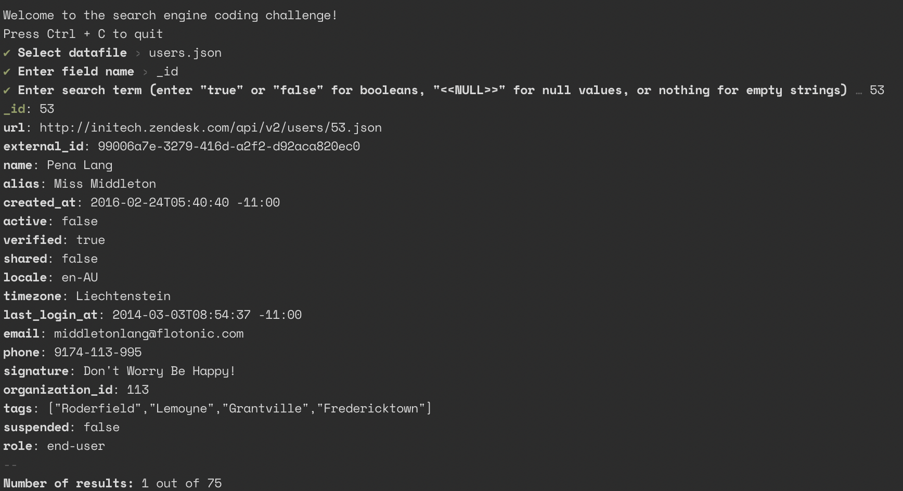

# Search coding challenge

## Quick start

Ensure that you have [node v14 or higher installed](https://nodejs.org/en/download/), then run:

```
npm install
npm run start
``` 

Follow the prompts to search the data files, found under the [`database`](./database) directory.



## Testing

To run the tests:

```
npm run test
```

or to run the watcher:

```
npm run test:watch
```

# Assumptions

## Search string matching

The requirements mention:

> The user should be able to search on any field, full value matching is fine (e.g. “mar” won’t return “mary”).

Does this mean that both the object key, and the object value accept full text matching, or was that only referring to the object key? I've assumed the former. Also, what about multiple words? Would a search for "mary" return the result "mary anne"? I've assumed not.

I have at least done some normalization, so the search terms are case-insensitive, and it will account for accented characters.

I didn't see `null` values in the data files (although I did see them hidden in some of the description strings), but I figured that this would need to be accounted for. To search for a null value, enter `<<NULL>>` as the search term. The downside with this approach is that if you actually wanted to search for that same string value, you can't. I didn't think it was worth it to revamp the UI for this coding challenge, but for any real production app, I would.

You can also search for `<<UNDEFINED>>` to search for missing object keys.

I also didn't see any nested objects in the sample data. I handle these anyway, by simply doing a search on every value of a nested object.

I didn't add in a way on how to search for entries that do not have the search key in the list entry. Although you can search for empty values as requested, simply press enter when asked for the search term. 

## Performance and Scalability

The script actually loads the entire JSON object into memory up front. It also scans the entire file before prompting for the field name, as so it can supply the results for the field name autocomplete.

In the challenge requirements, it uses 10,000+ users as an example to test. I've tested the solution with 877,500 users, at 470MB. It takes ~4580ms for the file to read into memory, and for it to query all of the possible fields. Then for the actual search of results, because everything is in memory, it only takes ~360ms.

For larger files however, I get an error, `Cannot create a string longer than 0x1fffffe8 characters`. To fix this, I would need to update the script to scan the JSON file in buffered increments, and remove the field name autocompletion. I might be able to use [stream-json](https://www.npmjs.com/package/stream-json) for this.

To ensure that that the UX will act gracefully. I've added a loading animation for any potentially long process. Although, the loading spinner will actually freeze if the synchronous processes take long enough. To solve this issue, I'd need to convert the `getAllItemKeys` and `showSearchResults` functions into web workers. I assumed that this would be going outside of scope.

I've also paginated the search results. This is so we don't potentially blast thousands of results to the user. It also means that we don't scan the entire data array if we don't need to, making it a prerequisite, if we wanted to scan the json file incrementally.

* Most of the application is unit tested. The main exception being the root index.ts file. This code would be better tested with integration tests, which I have not implemented. These tests are more expensive to write, but let me know if you'd still like to see them.
